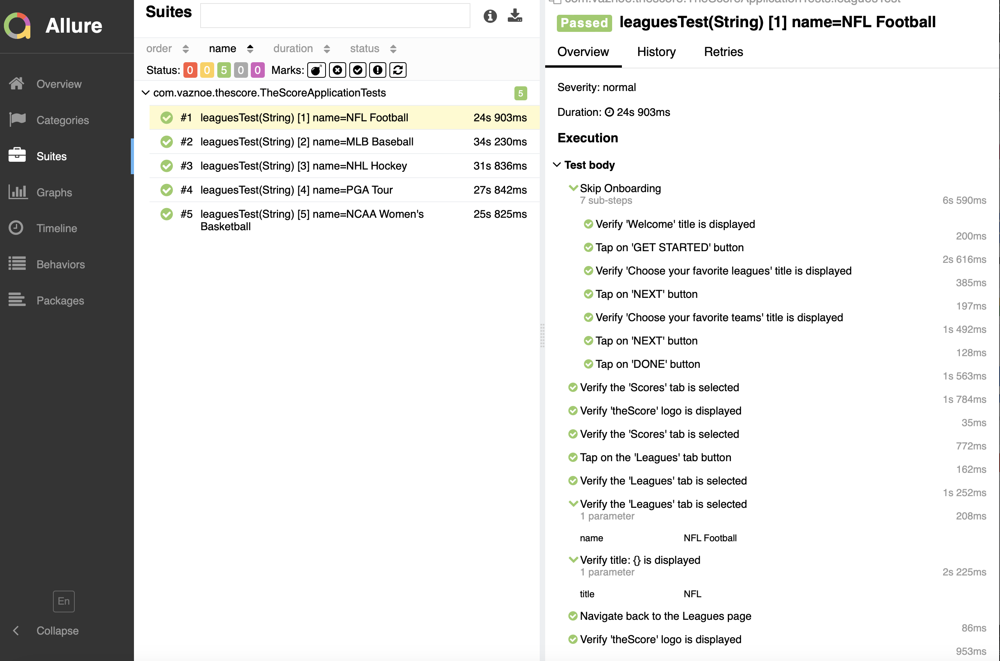

# Test Automation Framework

## Overview

This project utilizes Spring Boot 3, Java 11, Selenide with Appium 2, Maven, and Allure Report to create a comprehensive
testing framework for Android applications.

## Table of Contents

1. [Prerequisites](#prerequisites)
2. [Installation](#installation)
    - [Java 11](#java-11)
    - [Maven](#maven)
    - [Appium 2](#appium-2)
    - [Allure](#allure)
3. [Project Setup](#project-setup)
4. [Running Tests](#running-tests)
5. [Generating Allure Reports](#generating-allure-reports)
6. [Useful Links](#useful-links)

## Prerequisites

- Android device or emulator
- Internet connection for downloading dependencies

## Installation

### Java 11

Download and install Java 11 from the official Oracle website:
[Java 11 Download](https://www.oracle.com/java/technologies/javase-jdk11-downloads.html)

After installation, set the `JAVA_HOME` environment variable and add the Java `bin` directory to your `PATH`.

### Maven

Download and install Maven from the official Apache Maven website:
[Maven Download](https://maven.apache.org/download.cgi)

After installation, set the `M2_HOME` environment variable and add the Maven `bin` directory to your `PATH`.

### Appium 2

Install Appium 2 using npm:

```bash
npm install -g appium
```

Verify the installation by running:

```bash
appium -v
```

### Allure

```bash
brew install allure
```
[Install or upgrade Allure Report](https://allurereport.org/docs/install/)

## Project Setup

1. Clone the repository:
   ```bash
   git clone https://github.com/vaznoe/spring-boot-appium.git
   cd spring-boot-appium
   ```

2. Install project dependencies using Maven:
   ```bash
   ./mvnw clean install -DskipTests
   ```

## Running Tests

To run tests on your Android device or emulator, use the following command:

```bash
./mvnw clean test -Ddevice.name=${input your Android device name}
```

Replace `${input your Android device name}` with the actual name of your Android device or emulator.

## Generating Allure Reports

To generate and serve Allure reports, use the following command:

```bash
./mvnw io.qameta.allure:allure-maven:serve
```



## Useful Links

- [Spring Boot 3 Documentation](https://docs.spring.io/spring-boot/docs/current/reference/html/)
- [Java 11 Documentation](https://docs.oracle.com/en/java/javase/11/)
- [Selenide Documentation](https://selenide.org/)
- [Appium Documentation](http://appium.io/docs/en/about-appium/intro/)
- [Maven Documentation](https://maven.apache.org/guides/index.html)
- [Allure Report Documentation](https://docs.qameta.io/allure/)
